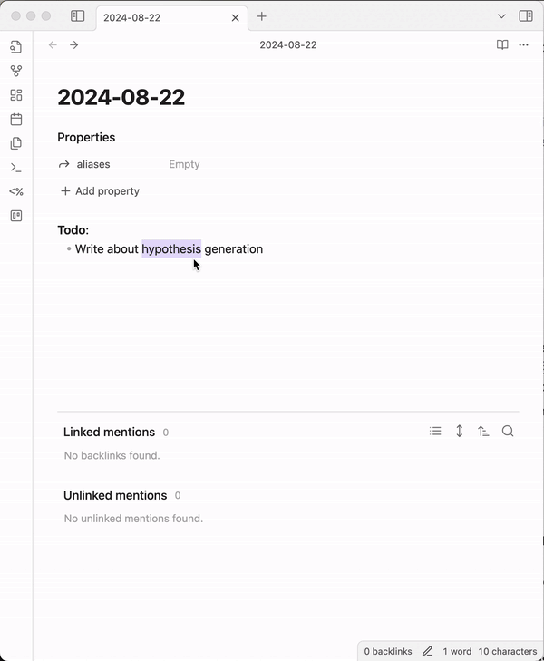

Auto-alias automatically generates plural/singular variations of your page title (e.g. Idea -> Ideas) and adds them as aliases onto any new pages.

This helps you avoid missing backlinks related to your pages and prevents the creation of duplicate pages for the same concept.

## Demo

1. When you create a new page - [[hypothesis]]
2. The plugin generates plural/singular versions of the title using an OpenAI model
3. It then adds those as aliases to your page - [[hypotheses]]
4. Now your backlinks for [[hypothesis]] show all mentions of both 'hypothesis' and 'hypotheses' in your vault 

By using an AI model, it should be able to handle some of the more tricky words with irregular plurals (e.g. People) and words that don't need pluralising (e.g. CEO, Series).

## Roadmap 

This is very much a basic v1, I would love your feedback on how I could improve it or which features would be useful! Please give feedback via Github Issues or email me directly: ptolemy8@protonmail.com

Plurals definitely feels like just one use-case for this mechanism. 

- Generating additional variations of page titles:
  - Abbreviations (Artificial Intelligence -> A.I )
  - Alternative spelling (Centrali*s*ed -> Centrali*z*ed)
  - Multi-lingual support (Ideas -> Ideen)
  - Punctuation (e.g. Sam -> Sam's)
- Additional triggers
  - Add aliases from existing pages
  - Bulk page editing
- Improved accuracy and fine-tuning of the model
- On-Device alias generation

## Installation
You can install the plugin via the Community Plugins tab within Obsidian. Just search for "Auto-alias".

## Note
- The plugin is still in beta and in need of feedback! Please give feedback via Github Issues or email me directly: ptolemy8@protonmail.com
- Page titles are temporarily sent to the OpenAI API to generate aliases. They are not stored by the plugin and OpenAI does not retain the data or use it train their models as per their [API privacy policy](https://openai.com/enterprise-privacy/)
- It is a closed-source plugin, reviewed by Obsidian developers

## FAQ's

### Do I need to add my own OpenAI API key?
No! The plugin handles that for you. 

### Will Auto-alias modify my existing aliases?
No, Auto-alias only adds new aliases and does not modify or remove any existing aliases on your pages.

### How does Auto-alias handle page titles in languages other than English?
Currently, Auto-alias is optimized for English. Multi-lingual support is on our roadmap for future updates.

